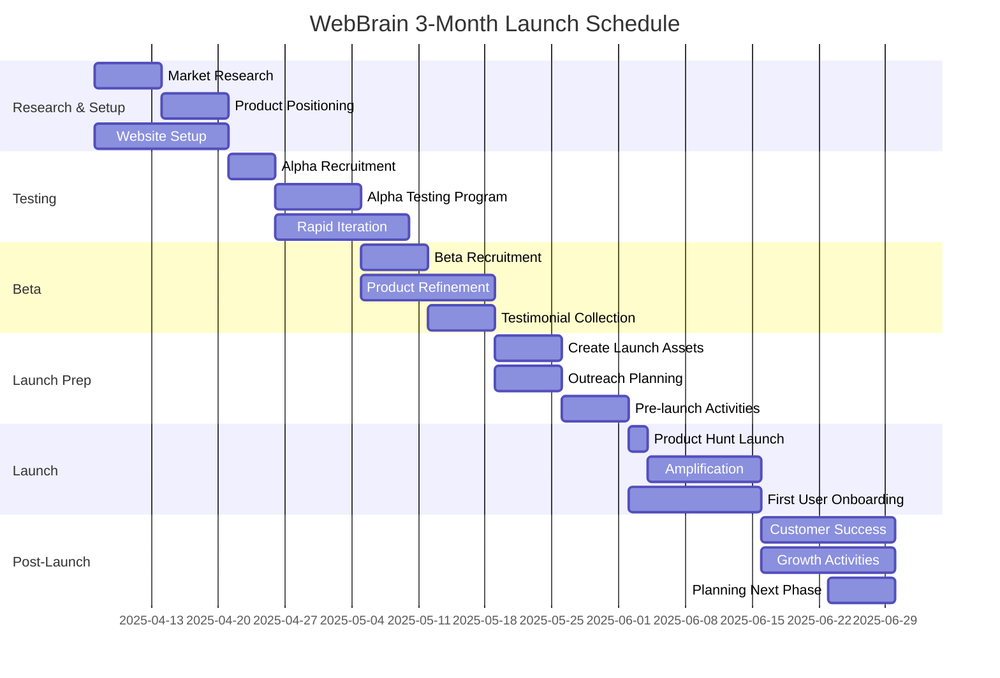

# WebBrain Product Launch Plan: 3-Month Timeline

## Week 1-2: Market Research & Preparation

### Market Analysis
- Conduct rapid competitive analysis of existing website AI tools
- Identify 1-2 initial target segments with highest value/need
- Research key pain points through 5-10 customer interviews

### Product Positioning 
- Develop concise value proposition highlighting automated knowledge acquisition
- Create streamlined messaging for website and launch materials
- Establish pricing tiers based on market research

### Website Setup
- Build minimal viable product website with clear demo and sign-up
- Create one short demo video showing the implementation process
- Prepare basic marketing assets (one-pager, comparison chart)

## Week 3-4: Alpha Testing

### Alpha Participant Recruitment
- Identify 8-10 diverse websites for initial testing
- Focus on founder network and warm connections for quick buy-in
- Prioritize sites that represent different use cases (e-commerce, content, service)

### Alpha Testing Program
- Provide hands-on onboarding for alpha participants
- Create private Slack channel for real-time feedback
- Collect structured feedback via weekly check-ins

### Rapid Iteration
- Implement daily bug fixes and improvements
- Address critical usability issues immediately
- Document common implementation challenges for knowledge base

## Week 5-6: Private Beta Expansion

### Beta Recruitment
- Expand test group to 25-30 websites
- Create waitlist with email capture on website
- Leverage alpha participants for referrals

### Product Refinement
- Finalize core feature set based on alpha feedback
- Polish user interface and onboarding flow
- Implement basic analytics to track usage patterns

### Testimonial Collection
- Gather initial success stories and quotes
- Create 2-3 brief case studies from alpha participants
- Prepare testimonials for Product Hunt and website

## Week 7-8: Launch Preparation

### Launch Assets Creation
- Finalize Product Hunt assets (images, description, key points)
- Create launch announcement email templates
- Prepare social media content calendar for launch week

### Outreach Planning
- Build targeted list of media contacts and influencers
- Prepare press release and media pitch
- Brief alpha/beta users on how to support the launch

### Pre-launch Activities
- Send exclusive preview to small list of industry influencers
- Create urgency with "early adopter" pricing promotion
- Test all sign-up and onboarding flows with fresh users

## Week 9-10: Public Launch

### Product Hunt Launch
- Schedule launch for optimal day (Tuesday/Wednesday)
- Assign team to monitor and respond to all comments
- Activate network for upvotes and engagement

### Amplification
- Email announcement to entire contact list
- Launch social media campaign across all channels
- Personally reach out to key industry contacts

### First User Onboarding
- Provide white-glove support for initial public users
- Host daily office hours for implementation questions
- Create quick-win templates for common website types

## Week 11-12: Post-Launch Optimization

### Customer Success
- Implement streamlined onboarding for new sign-ups
- Create initial knowledge base based on common questions
- Establish feedback loop for feature requests

### Growth Activities
- Analyze launch metrics and adjust acquisition strategy
- Implement referral incentives for existing users
- Begin targeted outreach to high-value prospects

### Planning Next Phase
- Prioritize feature roadmap based on launch feedback
- Identify partnership opportunities revealed during launch
- Set growth targets for the next quarter

## Key Success Metrics

### Pre-Launch
- Alpha/beta completion rate (target: 80%+)
- Implementation time (target: under 60 minutes)
- Initial satisfaction score (target: 8+/10)

### Launch
- Product Hunt ranking (target: top 5 daily)
- Website conversion rate (target: 10%+)
- First-week sign-ups (target: 100+)

### Post-Launch
- User activation rate (target: 60%+)
- 14-day retention (target: 70%+)
- Net Promoter Score (target: 40+)

## Critical Path Timeline

- **Week 1-2**: Market research, positioning, website setup
- **Week 3-4**: Alpha testing with 8-10 websites
- **Week 5-6**: Beta expansion to 25-30 websites
- **Week 7-8**: Launch preparation
- **Week 9-10**: Product Hunt launch and initial user onboarding
- **Week 11-12**: Post-launch optimization and planning
