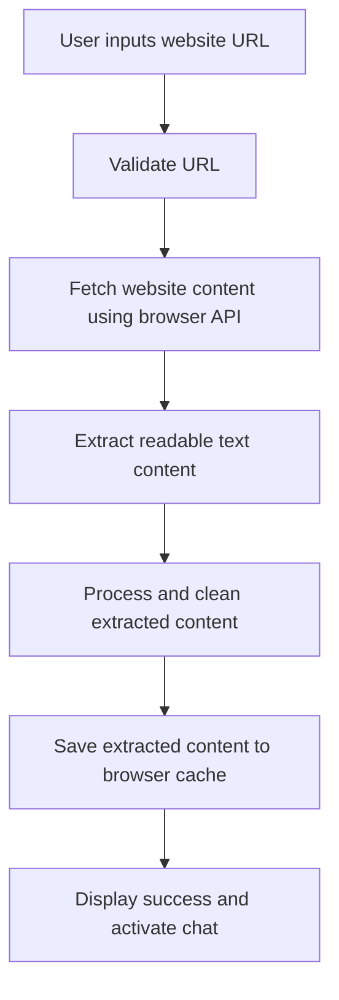
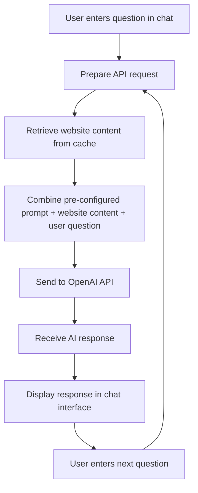
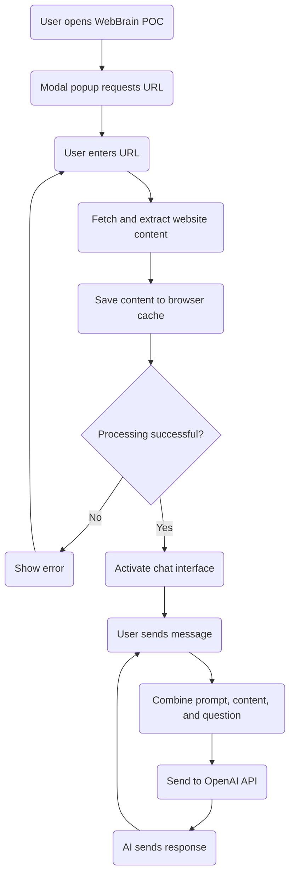

# WebBrain Proof of Concept - Software Specification

## Overview

This document outlines the specifications for a proof of concept (POC) of WebBrain, a tool that transforms any website into a customized AI. The POC will be a single-page web application that demonstrates the core functionality of extracting website content, processing it through an AI model, and enabling users to chat with an AI that has knowledge of the website content.

## Design Goals

1. Create a functioning demonstration of WebBrain's core value proposition
2. Provide a simple, intuitive user interface similar to the product mockups
3. Enable users to input website URLs and chat with the resulting AI
4. Implement browser-based functionality without requiring backend infrastructure
5. Package as a static site that can be hosted on Gitbook

## User Interface

The application will feature a two-column layout with a clean, professional design:

- **Color Scheme**: White background with WebBrain's brand green as accent color (#3CB371)
- **Typography**: Modern, clean font stack (system fonts)
- **Layout**: Two-column responsive design

### UI Components

1. **Header**
   - WebBrain logo and name
   - Tagline: "Transform websites into customized AI"

2. **Left Column (Sources)**
   - URL input section
   - List of processed website URLs
   - Processing status indicators

3. **Right Column (Chat)**
   - Chat interface with messages
   - Message input field
   - Send button

4. **Initial Popup**
   - Modal dialog requesting OpenAI API key input (for the first time)
   - Modal dialog requesting website URL input
   - Clear call-to-action button
   - Brief explanation of functionality

## Functionality

### Core Features

1. **Website Content Extraction**
   - Accept one website URL from user
   - Use browser fetch API to retrieve website content
   - Parse HTML to extract readable text content
   - Display loading/processing indicators

2. **AI Processing**
   - Send extracted text with user questions to OpenAI API
   - Use a pre-configured prompt to contextualize the website content
   - Handle API errors gracefully

3. **Chat Interface**
   - Enable conversation with the AI using the website content
   - Display messages in a threaded conversation view
   - Show typing indicators while waiting for AI responses
   - Support for basic markdown in responses

## Technical Implementation

### Technology Stack

- **Frontend**: Vanilla JavaScript
- **Styling**: CSS with variables for theming
- **APIs**: OpenAI API for AI processing
- **Deployment**: Static site (can be hosted on Gitbook)

### Simplified Architecture

The application will be built with only three files for maximum simplicity:

```
WebBrainPOC/
├── index.html        # HTML structure and UI components
├── app.js            # All JavaScript logic
└── style.css         # All styling
```

### File Responsibilities

1. **index.html**
   - Basic HTML structure
   - UI layout and components
   - References to app.js and style.css

2. **app.js**
   - Application state management
   - Event handlers and UI manipulation
   - Website content extraction
   - Browser cache management
   - OpenAI API integration
   - Chat functionality
   - LocalStorage for persistence

3. **style.css**
   - Global styles and CSS variables
   - Layout and responsive design
   - Component styling
   - States (loading, error, etc.)

### OpenAI API Integration

The WebBrain POC will integrate with the OpenAI API using the assistant API to process website content and user questions. The integration follows these steps:

1. **Prompt Configuration**
   - A pre-configured system prompt instructs the model as follows:
   
   ```
   You are an friendly AI assistant to help users learn more about the website content. You are expected to always respond with references. For example, if I ask you "What is Numbers Protocol?", you will reply "Based on https://numbersprotocol.io, it is a decentralized network". You will do your best to look for answers from the website content instead of the pre-existing memory. Here is the website content:
   
   [WEBSITE_CONTENT_PLACEHOLDER]
   ```
   - The `[WEBSITE_CONTENT_PLACEHOLDER]` is replaced with the actual extracted website content
   - User questions are processed within this context

2. **API Interaction**
   - User questions are sent to the OpenAI API along with the website content
   - API returns responses based on the provided content and question
   - Rate limits and token usage are managed appropriately

3. **API Endpoints Used**
   - `POST /chat/completions` - For chat interactions using the provided content

4. **Error Handling**
   - Validation errors during content extraction are caught and displayed to the user
   - API failures trigger retry mechanisms with exponential backoff
   - Rate limit handling ensures compliance with OpenAI's usage policies

### Data Flow

The data flow is divided into two distinct phases:

#### Phase 1: Scraping


1. User inputs a single website URL
2. Application validates the URL format
3. Browser fetch API retrieves the website content
4. HTML is parsed to extract readable text content
5. Content is processed and cleaned
6. Extracted content is saved in browser cache/localStorage
7. Success indicator is shown and chat interface is activated

#### Phase 2: Chatting


1. User interacts with the chat window and inputs a question
2. Application retrieves the cached website content from browser storage
3. Pre-configured prompt is combined with the website content and user question
4. Combined data is sent to the OpenAI API
5. API processes the request and generates a response
6. Response is received and displayed in the chat interface
7. Process repeats for subsequent questions

## User Flow

1. **Initial Visit**
   - User arrives at the WebBrain POC page
   - Modal popup appears requesting website URL
   - User enters URL and clicks "Process" or presses Enter

2. **Processing Phase**
   - System shows loading indicator
   - Website content is extracted and processed
   - Status updates are shown to user

3. **Chat Phase**
   - Upon successful processing, chat interface becomes active
   - User can enter messages in the input field
   - AI responds based on the website knowledge

### User Flow Diagram



This diagram illustrates the simplified user journey from initial visit through website processing and into the chat interaction phase.

## Implementation Notes

### HTML Structure

The `index.html` file will contain:

- Document structure and metadata
- Header with branding
- Two-column layout container
- Left column for URL inputs and source list
- Right column for chat interface
- Modal popup for initial URL input
- Script and style references

### JavaScript Implementation

The `app.js` file will contain:

- Global variables for application state
- Initialization function
- URL validation and processing functions
- Website content extraction (using fetch API)
- Text extraction from HTML (using DOMParser)
- Browser cache management (localStorage)
- OpenAI API integration functions
- Chat message handling
- UI update functions
- Event listeners for user interactions

### CSS Styling

The `style.css` file will contain:

- CSS variables for theming (colors, spacing)
- Reset and base styles
- Layout styles (grid/flexbox for columns)
- Component styles (inputs, buttons, message bubbles)
- Responsive design rules
- Animation and transition effects
- State-based styling

## API Integration

### OpenAI API Requirements

- API Key management (client-side for POC, with appropriate warnings)
- Store the OpenAI API Key in the browser. If the API Key does not exist, use the pop-up dialog to ask the user to provide
- Endpoints needed:
  - Chat completion

### Fallback and Error Handling

- Connection errors
- Invalid URLs
- CORS restrictions
- API rate limiting
- Processing failures

## Limitations and Considerations

1. **Client-side Processing**
   - Limited to publicly accessible websites
   - CORS restrictions may prevent accessing some sites
   - Processing larger sites may be resource-intensive

2. **Security and Privacy**
   - API keys should not be hard-coded
   - User should understand data transmission to OpenAI
   - Consider using proxy for production version

3. **Performance**
   - Optimize content extraction for speed
   - Implement chunking for larger websites
   - Consider caching mechanisms for repeated queries

## Development Approach

1. **Progressive Enhancement**
   - Start with basic functionality
   - Create minimal viable product
   - Add features incrementally

2. **Testing Strategy**
   - Test with various websites
   - Verify content extraction
   - Test chat responsiveness

3. **Deployment**
   - Package as static files
   - Host on Github page
   - Consider CDN for production

## Future Enhancements (Beyond POC)

1. Server-side processing for better performance and security
2. Multiple website merging into a single knowledge base
3. Customization options for AI behavior and responses
4. Export/import functionality for created models
5. Analytics on chat usage and common questions
