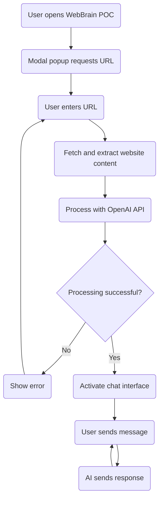
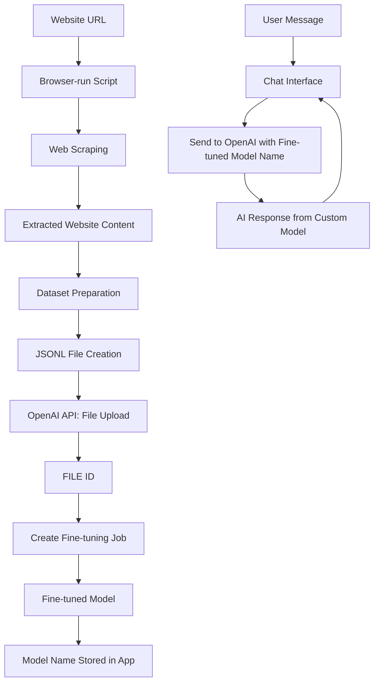

# WebBrain Proof of Concept - Software Specification

## Overview

This document outlines the specifications for a proof of concept (POC) of WebBrain, a tool that transforms any website into a customized AI. The POC will be a single-page web application that demonstrates the core functionality of extracting website content, processing it through an AI model, and enabling users to chat with an AI that has knowledge of the website content.

## Design Goals

1. Create a functioning demonstration of WebBrain's core value proposition
2. Provide a simple, intuitive user interface similar to the product mockups
3. Enable users to input website URLs and chat with the resulting AI
4. Implement browser-based functionality without requiring backend infrastructure
5. Package as a static site that can be hosted on Gitbook

## User Interface

The application will feature a two-column layout with a clean, professional design:

- **Color Scheme**: White background with WebBrain's brand green as accent color (#3CB371)
- **Typography**: Modern, clean font stack (system fonts)
- **Layout**: Two-column responsive design

### UI Components

1. **Header**
   - WebBrain logo and name
   - Tagline: "Transform websites into customized AI"

2. **Left Column (Sources)**
   - URL input section
   - List of processed website URLs
   - Processing status indicators

3. **Right Column (Chat)**
   - Chat interface with messages
   - Message input field
   - Send button

4. **Initial Popup**
   - Modal dialog requesting website URL input
   - Clear call-to-action button
   - Brief explanation of functionality

## Functionality

### Core Features

1. **Website Content Extraction**
   - Accept one website URL from user
   - Use browser fetch API to retrieve website content
   - Parse HTML to extract readable text content
   - Display loading/processing indicators

2. **AI Processing**
   - Send extracted text to OpenAI API
   - Request creation of a customized model based on content
   - Store and manage the returned model ID
   - Handle API errors gracefully

3. **Chat Interface**
   - Enable conversation with the AI using the model ID
   - Display messages in a threaded conversation view
   - Show typing indicators while waiting for AI responses
   - Support for basic markdown in responses

## Technical Implementation

### Technology Stack

- **Frontend**: Vanilla JavaScript
- **Styling**: CSS with variables for theming
- **APIs**: OpenAI API for AI processing
- **Deployment**: Static site (can be hosted on Gitbook)

### Simplified Architecture

The application will be built with only three files for maximum simplicity:

```
WebBrainPOC/
├── index.html        # HTML structure and UI components
├── app.js            # All JavaScript logic
└── style.css         # All styling
```

### File Responsibilities

1. **index.html**
   - Basic HTML structure
   - UI layout and components
   - References to app.js and style.css

2. **app.js**
   - Application state management
   - Event handlers and UI manipulation
   - Website content extraction
   - JSON file creation for OpenAI API
   - OpenAI API integration
   - Chat functionality
   - LocalStorage for persistence

3. **style.css**
   - Global styles and CSS variables
   - Layout and responsive design
   - Component styling
   - States (loading, error, etc.)

### OpenAI API Integration

The WebBrain POC will integrate with the OpenAI API using the fine-tuning process to create a customized AI model based on website content. The integration follows these detailed steps:

1. **JSONL File Preparation**
   - Scraped website content is converted into training examples in JSONL format (JSON Lines)
   - Each line in the JSONL file represents a separate training example
   - Training examples follow this structure:
     ```json
     {"messages": [{"role": "system", "content": "You are an AI assistant with knowledge about [website name]."}, {"role": "user", "content": "What is [topic from website]?"}, {"role": "assistant", "content": "The information about [topic] is [content from website]."}]}
     ```
   - Multiple question-answer pairs are generated based on the website content
   - The JSONL file is validated for proper formatting before upload

2. **File Upload**
   - The JSONL file is uploaded to OpenAI API using the `POST /files` endpoint
   - Request includes purpose parameter set to "fine-tuning"
   - API returns a FILE ID (e.g., "file-abc123") that uniquely identifies the uploaded training data

3. **Fine-Tuning Job Creation**
   - A fine-tuning job is created using the `POST /fine_tuning/jobs` endpoint
   - The request includes:
     - The FILE ID from the previous step
     - The base model to fine-tune (e.g., "gpt-3.5-turbo")
     - Optional hyperparameters like epochs
   - API returns a job ID (e.g., "ftjob-abc123") to track the fine-tuning process

4. **Job Monitoring**
   - The application polls the `GET /fine_tuning/jobs/{job_id}` endpoint to check fine-tuning status
   - Status indicators are shown to the user during this process
   - Once complete, the API returns a fine-tuned model name (e.g., "ft:gpt-3.5-turbo:my-org:custom_suffix:abc123")

5. **Using the Fine-Tuned Model**
   - The fine-tuned model name is stored in the application
   - User messages are sent to the `POST /chat/completions` endpoint with this model name
   - The API response incorporates the customized knowledge from the website

6. **API Endpoints Used**
   - `POST /files` - For uploading the JSONL training file
   - `POST /fine_tuning/jobs` - For creating a fine-tuning job
   - `GET /fine_tuning/jobs/{job_id}` - For checking job status
   - `POST /chat/completions` - For chat interactions using the fine-tuned model

7. **Error Handling**
   - Validation errors during file preparation are caught and displayed to the user
   - Upload failures trigger retry mechanisms with exponential backoff
   - Fine-tuning job failures are reported with specific error messages
   - Rate limit handling ensures compliance with OpenAI's usage policies

### Data Flow

1. User inputs website URL(s)
2. Application fetches and extracts content from URL(s)
3. Extracted content is sent to OpenAI API
4. API returns model ID for the processed content
5. Model ID is stored in browser session/local storage
6. User interacts with AI using the chat interface
7. Messages are sent to OpenAI API with the model ID
8. AI responses are displayed in the chat interface

## User Flow

1. **Initial Visit**
   - User arrives at the WebBrain POC page
   - Modal popup appears requesting website URL
   - User enters URL and clicks "Process" or presses Enter

2. **Processing Phase**
   - System shows loading indicator
   - Website content is extracted and processed
   - Status updates are shown to user

3. **Chat Phase**
   - Upon successful processing, chat interface becomes active
   - User can enter messages in the input field
   - AI responds based on the website knowledge

### User Flow Diagram



The diagram shows the straightforward flow from opening the application to chatting with the AI based on the processed website content.

### Data Flow Diagram



This diagram shows how the browser-run script scrapes website data, prepares it as a dataset, formats it as a JSONL file, and uploads it to the OpenAI API which returns a FILE ID. This FILE ID is then used to create a fine-tuning job that produces a customized model, which enables AI responses based on the website content.

This diagram illustrates the simplified user journey in a single session. All data is session-based, and closing the tab will reset the application state.

This diagram illustrates the complete user journey from initial visit through website processing and into the chat interaction phase.

## Implementation Notes

### HTML Structure

The `index.html` file will contain:

- Document structure and metadata
- Header with branding
- Two-column layout container
- Left column for URL inputs and source list
- Right column for chat interface
- Modal popup for initial URL input
- Script and style references

### JavaScript Implementation

The `app.js` file will contain:

- Global variables for application state
- Initialization function
- URL validation and processing functions
- Website content extraction (using fetch API)
- Text extraction from HTML (using DOMParser)
- OpenAI API integration functions
- Chat message handling
- UI update functions
- Local storage for saving state
- Event listeners for user interactions

### CSS Styling

The `style.css` file will contain:

- CSS variables for theming (colors, spacing)
- Reset and base styles
- Layout styles (grid/flexbox for columns)
- Component styles (inputs, buttons, message bubbles)
- Responsive design rules
- Animation and transition effects
- State-based styling

## API Integration

### OpenAI API Requirements

- API Key management (client-side for POC, with appropriate warnings)
- Endpoints needed:
  - Model creation/fine-tuning
  - Chat completion

### Fallback and Error Handling

- Connection errors
- Invalid URLs
- CORS restrictions
- API rate limiting
- Processing failures

## Limitations and Considerations

1. **Client-side Processing**
   - Limited to publicly accessible websites
   - CORS restrictions may prevent accessing some sites
   - Processing larger sites may be resource-intensive

2. **Security and Privacy**
   - API keys should not be hard-coded
   - User should understand data transmission to OpenAI
   - Consider using proxy for production version

3. **Performance**
   - Optimize content extraction for speed
   - Implement chunking for larger websites
   - Consider caching mechanisms for repeated queries

## Development Approach

1. **Progressive Enhancement**
   - Start with basic functionality
   - Create minimal viable product
   - Add features incrementally

2. **Testing Strategy**
   - Test with various websites
   - Verify content extraction
   - Test chat responsiveness

3. **Deployment**
   - Package as static files
   - Host on Github page
   - Consider CDN for production

## Future Enhancements (Beyond POC)

1. Server-side processing for better performance and security
2. Multiple website merging into a single knowledge base
3. Customization options for AI behavior and responses
4. Export/import functionality for created models
5. Analytics on chat usage and common questions
