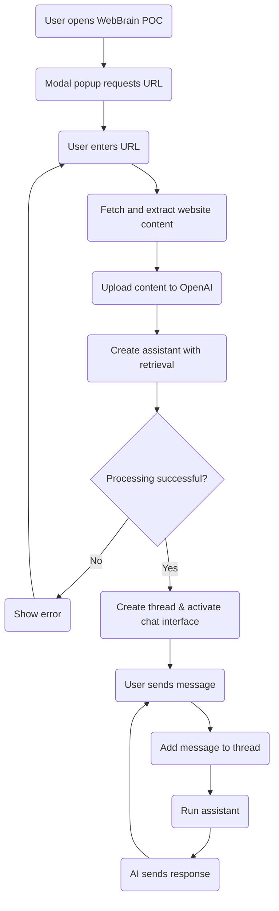
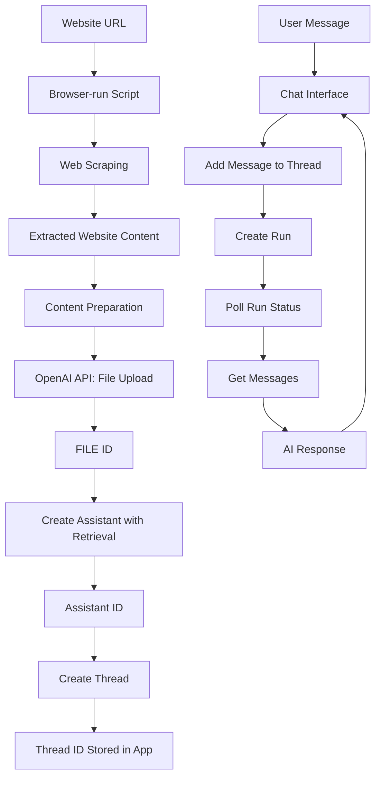

# WebBrain Proof of Concept - Software Specification

## Overview

This document outlines the specifications for a proof of concept (POC) of WebBrain, a tool that transforms any website into a customized AI. The POC will be a single-page web application that demonstrates the core functionality of extracting website content, processing it through an AI model, and enabling users to chat with an AI that has knowledge of the website content.

## Design Goals

1. Create a functioning demonstration of WebBrain's core value proposition
2. Provide a simple, intuitive user interface similar to the product mockups
3. Enable users to input website URLs and chat with the resulting AI
4. Implement browser-based functionality without requiring backend infrastructure
5. Package as a static site that can be hosted on Gitbook

## User Interface

The application will feature a two-column layout with a clean, professional design:

- **Color Scheme**: White background with WebBrain's brand green as accent color (#3CB371)
- **Typography**: Modern, clean font stack (system fonts)
- **Layout**: Two-column responsive design

### UI Components

1. **Header**
   - WebBrain logo and name
   - Tagline: "Transform websites into customized AI"

2. **Left Column (Sources)**
   - URL input section
   - List of processed website URLs
   - Processing status indicators

3. **Right Column (Chat)**
   - Chat interface with messages
   - Message input field
   - Send button

4. **Initial Popup**
   - Modal dialog requesting website URL input
   - Clear call-to-action button
   - Brief explanation of functionality

## Functionality

### Core Features

1. **Website Content Extraction**
   - Accept one website URL from user
   - Use browser fetch API to retrieve website content
   - Parse HTML to extract readable text content
   - Display loading/processing indicators

2. **AI Processing**
   - Clean and format extracted website content
   - Upload content to OpenAI's Files API
   - Create a custom assistant with retrieval capabilities via OpenAI's Assistants API
   - Store and manage the assistant and thread IDs
   - Handle API errors gracefully

3. **Chat Interface**
   - Enable conversation with the AI using OpenAI's Assistants API
   - Display messages in a threaded conversation view
   - Show typing indicators while waiting for AI responses
   - Support for basic markdown in responses

## Technical Implementation

### Technology Stack

- **Frontend**: Vanilla JavaScript
- **Styling**: CSS with variables for theming
- **APIs**: OpenAI API for Assistants, Files, and Threads
- **Deployment**: Static site (can be hosted on Gitbook)

### Simplified Architecture

The application will be built with only three files for maximum simplicity:

```
WebBrainPOC/
├── index.html        # HTML structure and UI components
├── app.js            # All JavaScript logic
└── style.css         # All styling
```

### File Responsibilities

1. **index.html**
   - Basic HTML structure
   - UI layout and components
   - References to app.js and style.css

2. **app.js**
   - Application state management
   - Event handlers and UI manipulation
   - Website content extraction
   - Text preparation for OpenAI
   - OpenAI API integration
   - Chat functionality
   - Session storage for persistence

3. **style.css**
   - Global styles and CSS variables
   - Layout and responsive design
   - Component styling
   - States (loading, error, etc.)

### OpenAI API Integration

The WebBrain POC will integrate with OpenAI's APIs using a Retrieval Augmented Generation (RAG) approach to create an AI that can answer questions about website content. The integration follows these detailed steps:

1. **Content Preparation**
   - Scraped website content is cleaned and formatted as text
   - The content is prepared as a file for upload to OpenAI
   - No manual chunking is required - OpenAI handles this automatically

2. **File Upload**
   - The content file is uploaded to OpenAI API using the `POST /files` endpoint
   - Request includes purpose parameter set to "assistants"
   - API returns a FILE ID (e.g., "file-abc123") that uniquely identifies the uploaded content

3. **Assistant Creation**
   - An assistant is created using the `POST /assistants` endpoint
   - The request includes:
     - The model to use (e.g., "gpt-4-turbo")
     - Instructions for the assistant
     - The retrieval tool enabled
     - The FILE ID from the previous step
   - API returns an assistant ID that represents the AI with knowledge of the website

4. **Thread Creation**
   - A new thread is created using the `POST /threads` endpoint
   - This thread will store the conversation between the user and the assistant

5. **Using the Assistant**
   - User messages are added to the thread via the `POST /threads/{thread_id}/messages` endpoint
   - A run is created to generate a response using the `POST /threads/{thread_id}/runs` endpoint
   - The application polls the `GET /threads/{thread_id}/runs/{run_id}` endpoint to check run status
   - Once complete, the response is retrieved using the `GET /threads/{thread_id}/messages` endpoint

6. **API Endpoints Used**
   - `POST /files` - For uploading the website content
   - `POST /assistants` - For creating the assistant with retrieval capabilities
   - `POST /threads` - For creating conversation threads
   - `POST /threads/{thread_id}/messages` - For adding user messages
   - `POST /threads/{thread_id}/runs` - For generating assistant responses
   - `GET /threads/{thread_id}/runs/{run_id}` - For checking run status
   - `GET /threads/{thread_id}/messages` - For retrieving messages

7. **Error Handling**
   - Content processing errors are caught and displayed to the user
   - Upload failures trigger retry mechanisms with exponential backoff
   - Run failures are reported with specific error messages
   - Rate limit handling ensures compliance with OpenAI's usage policies

### Data Flow

1. User inputs website URL(s)
2. Application fetches and extracts content from URL(s)
3. Cleaned content is uploaded to OpenAI via Files API
4. Custom assistant is created with the file and retrieval capability
5. Thread is created for the conversation
6. User interacts with AI using the chat interface
7. Messages are added to the thread and runs are created
8. OpenAI automatically retrieves relevant information from the uploaded content
9. AI responses are displayed in the chat interface

## User Flow

1. **Initial Visit**
   - User arrives at the WebBrain POC page
   - Modal popup appears requesting website URL
   - User enters URL and clicks "Process" or presses Enter

2. **Processing Phase**
   - System shows loading indicator
   - Website content is extracted, cleaned, and uploaded
   - Assistant is created with retrieval capabilities
   - Status updates are shown to user

3. **Chat Phase**
   - Upon successful processing, chat interface becomes active
   - User can enter messages in the input field
   - AI responds based on the website knowledge using automatic retrieval

### User Flow Diagram



The diagram shows the straightforward flow from opening the application to chatting with the AI based on the processed website content.

### Data Flow Diagram



This diagram shows how the browser-run script scrapes website data, uploads it to OpenAI's Files API, and creates an assistant with retrieval capabilities. The assistant uses the uploaded content to provide responses to user questions through a thread-based conversation.

## Implementation Notes

### HTML Structure

The `index.html` file will contain:

- Document structure and metadata
- Header with branding
- Two-column layout container
- Left column for URL inputs and source list
- Right column for chat interface
- Modal popup for initial URL input
- Script and style references

### JavaScript Implementation

The `app.js` file will contain:

- Global variables for application state
- Initialization function
- URL validation and processing functions
- Website content extraction (using fetch API)
- Text extraction from HTML (using DOMParser)
- Content preparation for OpenAI
- OpenAI API integration functions
- Thread and message handling
- UI update functions
- Session storage for saving state
- Event listeners for user interactions

### CSS Styling

The `style.css` file will contain:

- CSS variables for theming (colors, spacing)
- Reset and base styles
- Layout styles (grid/flexbox for columns)
- Component styles (inputs, buttons, message bubbles)
- Responsive design rules
- Animation and transition effects
- State-based styling

## API Integration

### OpenAI API Requirements

- API Key management (client-side for POC, with appropriate warnings)
- Endpoints needed:
  - Files API for content upload
  - Assistants API for creating assistants with retrieval
  - Threads and Messages API for conversation management

### Fallback and Error Handling

- Connection errors
- Invalid URLs
- CORS restrictions
- API rate limiting
- Processing failures

## Limitations and Considerations

1. **Client-side Processing**
   - Limited to publicly accessible websites
   - CORS restrictions may prevent accessing some sites
   - Processing larger sites may be resource-intensive
   - API rate limits and file size limitations

2. **Security and Privacy**
   - API keys should not be hard-coded
   - User should understand data transmission to OpenAI
   - Website content is stored on OpenAI's servers
   - Consider using proxy for production version

3. **Performance**
   - Optimize content extraction for better retrieval results
   - Be aware of OpenAI's API usage costs and limits
   - Consider OpenAI's file retention policies

## Development Approach

1. **Progressive Enhancement**
   - Start with basic functionality
   - Create minimal viable product
   - Add features incrementally

2. **Testing Strategy**
   - Test with various websites
   - Verify content extraction
   - Test chat responsiveness

3. **Deployment**
   - Package as static files
   - Host on Github page
   - Consider CDN for production

## Example Implementation Code

```javascript
// Upload website content to OpenAI
async function uploadWebsiteContent(content, siteName) {
  const formData = new FormData();
  const contentBlob = new Blob([content], { type: 'text/plain' });
  formData.append('file', contentBlob, `${siteName}.txt`);
  formData.append('purpose', 'assistants');

  const response = await fetch('https://api.openai.com/v1/files', {
    method: 'POST',
    headers: {
      'Authorization': `Bearer ${apiKey}`
    },
    body: formData
  });
  
  return await response.json();
}

// Create assistant with retrieval
async function createAssistant(fileId, siteName) {
  const response = await fetch('https://api.openai.com/v1/assistants', {
    method: 'POST',
    headers: {
      'Authorization': `Bearer ${apiKey}`,
      'Content-Type': 'application/json'
    },
    body: JSON.stringify({
      model: "gpt-4-turbo",
      name: `WebBrain - ${siteName}`,
      instructions: `You are an AI assistant with knowledge about ${siteName}. 
                    Answer questions based on the content from this website.
                    If the answer cannot be found in the provided information, say so.`,
      tools: [{"type": "retrieval"}],
      file_ids: [fileId]
    })
  });
  
  return await response.json();
}

// Create a new thread
async function createThread() {
  const response = await fetch('https://api.openai.com/v1/threads', {
    method: 'POST',
    headers: {
      'Authorization': `Bearer ${apiKey}`,
      'Content-Type': 'application/json'
    },
    body: JSON.stringify({})
  });
  
  return await response.json();
}
```

## Future Enhancements (Beyond POC)

1. Server-side processing for better performance and security
2. Multiple website merging into a single assistant knowledge base
3. Customization options for AI behavior and responses
4. Save/restore functionality for created assistants and threads
5. Analytics on chat usage and common questions