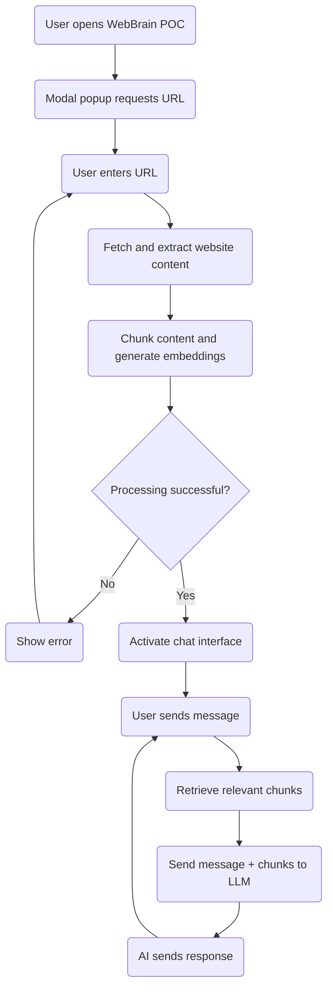
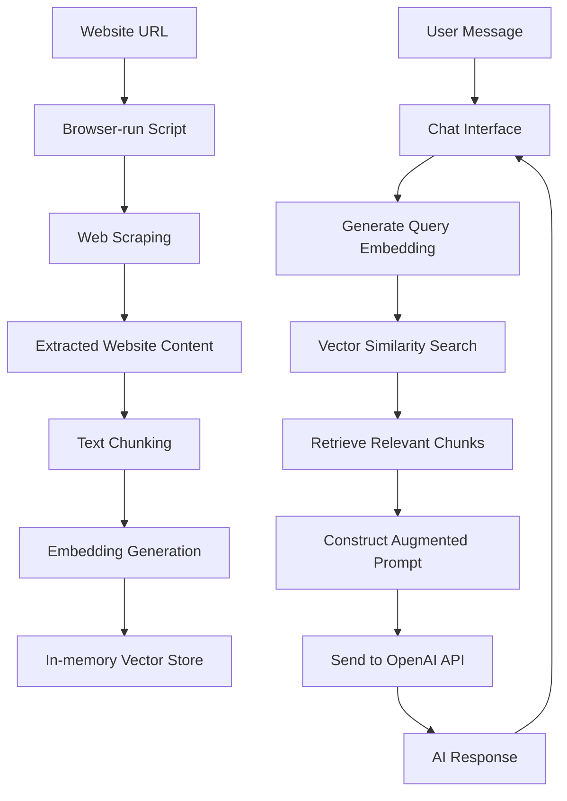

# WebBrain Proof of Concept - Software Specification (RAG Version)

## Overview

This document outlines the specifications for a proof of concept (POC) of WebBrain, a tool that transforms any website into a customized AI. The POC will be a single-page web application that demonstrates the core functionality of extracting website content, processing it through a RAG (Retrieval Augmented Generation) system, and enabling users to chat with an AI that has knowledge of the website content.

## Design Goals

1. Create a functioning demonstration of WebBrain's core value proposition
2. Provide a simple, intuitive user interface similar to the product mockups
3. Enable users to input website URLs and chat with the resulting AI
4. Implement browser-based functionality without requiring backend infrastructure
5. Package as a static site that can be hosted on Gitbook

## User Interface

The application will feature a two-column layout with a clean, professional design:

- **Color Scheme**: White background with WebBrain's brand green as accent color (#3CB371)
- **Typography**: Modern, clean font stack (system fonts)
- **Layout**: Two-column responsive design

### UI Components

1. **Header**
   - WebBrain logo and name
   - Tagline: "Transform websites into customized AI"

2. **Left Column (Sources)**
   - URL input section
   - List of processed website URLs
   - Processing status indicators

3. **Right Column (Chat)**
   - Chat interface with messages
   - Message input field
   - Send button

4. **Initial Popup**
   - Modal dialog requesting website URL input
   - Clear call-to-action button
   - Brief explanation of functionality

## Functionality

### Core Features

1. **Website Content Extraction**
   - Accept one website URL from user
   - Use browser fetch API to retrieve website content
   - Parse HTML to extract readable text content
   - Display loading/processing indicators

2. **RAG Implementation**
   - Split extracted content into chunks of appropriate size
   - Generate embeddings for each content chunk
   - Store chunks and embeddings in browser memory
   - Implement vector similarity search for retrieval

3. **Chat Interface**
   - Enable conversation with the AI using RAG-enhanced prompts
   - Display messages in a threaded conversation view
   - Show typing indicators while waiting for AI responses
   - Support for basic markdown in responses

## Technical Implementation

### Technology Stack

- **Frontend**: Vanilla JavaScript
- **Styling**: CSS with variables for theming
- **APIs**: OpenAI API for embeddings and chat completion
- **Libraries**: TensorFlow.js or a lightweight vector similarity solution
- **Deployment**: Static site (can be hosted on Gitbook)

### Simplified Architecture

The application will be built with only three files for maximum simplicity:

```
WebBrainPOC/
├── index.html        # HTML structure and UI components
├── app.js            # All JavaScript logic
└── style.css         # All styling
```

### File Responsibilities

1. **index.html**
   - Basic HTML structure
   - UI layout and components
   - References to app.js and style.css

2. **app.js**
   - Application state management
   - Event handlers and UI manipulation
   - Website content extraction
   - Text chunking and processing
   - Embedding generation and storage
   - Vector similarity search
   - OpenAI API integration
   - Chat functionality
   - LocalStorage for persistence

3. **style.css**
   - Global styles and CSS variables
   - Layout and responsive design
   - Component styling
   - States (loading, error, etc.)

### RAG Implementation Details

The WebBrain POC will implement a browser-based RAG system that works as follows:

1. **Content Processing**
   - Scraped website content is cleaned and normalized
   - Content is split into chunks of appropriate size (e.g., 1000 characters with 200 character overlap)
   - Chunks are stored in an array in the application's memory

2. **Embedding Generation**
   - Each chunk is processed to generate an embedding vector
   - Embeddings are generated using OpenAI's embedding API (`POST /embeddings`)
   - The embedding vectors are stored alongside their corresponding text chunks

3. **Vector Database**
   - A simple in-memory vector store is implemented in JavaScript
   - This stores text chunks and their corresponding embedding vectors
   - Provides search capabilities based on vector similarity

4. **Retrieval Process**
   - When a user sends a message, its embedding is generated
   - The system performs a similarity search against stored embeddings
   - The most relevant chunks (top k) are retrieved

5. **Context Augmentation**
   - Retrieved chunks are added to the prompt sent to the LLM
   - A system message instructs the LLM to use this context to answer the query
   - The prompt structure follows this pattern:
     ```
     System: You are an AI assistant with knowledge about [website name]. 
     Use the following information to answer the user's question. 
     If the answer cannot be found in the provided information, say so.
     
     [Retrieved chunks]
     
     User: [User's question]
     ```

6. **API Endpoints Used**
   - `POST /embeddings` - For generating embeddings for chunks and queries
   - `POST /chat/completions` - For chat interactions with context augmentation

7. **Error Handling**
   - Content processing errors are caught and displayed to the user
   - Embedding generation failures trigger retries with exponential backoff
   - Similarity search edge cases are handled gracefully
   - Rate limit handling ensures compliance with OpenAI's usage policies

### Data Flow

1. User inputs website URL(s)
2. Application fetches and extracts content from URL(s)
3. Content is chunked and processed
4. Embeddings are generated for each chunk
5. Chunks and embeddings are stored in browser memory/local storage
6. User interacts with AI using the chat interface
7. User query is embedded and similar chunks are retrieved
8. Retrieved chunks and user query are sent to OpenAI API
9. AI responses are displayed in the chat interface

## User Flow

1. **Initial Visit**
   - User arrives at the WebBrain POC page
   - Modal popup appears requesting website URL
   - User enters URL and clicks "Process" or presses Enter

2. **Processing Phase**
   - System shows loading indicator
   - Website content is extracted, chunked, and embedded
   - Status updates are shown to user

3. **Chat Phase**
   - Upon successful processing, chat interface becomes active
   - User can enter messages in the input field
   - System retrieves relevant content chunks
   - AI responds based on the retrieved context

### User Flow Diagram



The diagram shows the straightforward flow from opening the application to chatting with the AI based on the processed website content.

### Data Flow Diagram



This diagram illustrates how the browser-run script scrapes website data, processes it into chunks, and generates embeddings to create a simple vector store. When the user sends a message, the system performs similarity search to retrieve relevant chunks, which are then used to augment the prompt sent to the OpenAI API.

## Implementation Notes

### HTML Structure

The `index.html` file will contain:

- Document structure and metadata
- Header with branding
- Two-column layout container
- Left column for URL inputs and source list
- Right column for chat interface
- Modal popup for initial URL input
- Script and style references

### JavaScript Implementation

The `app.js` file will contain:

- Global variables for application state
- Initialization function
- URL validation and processing functions
- Website content extraction (using fetch API)
- Text extraction from HTML (using DOMParser)
- Text chunking and processing functions
- Embedding generation via OpenAI API
- Simple vector similarity search implementation
- OpenAI API integration functions
- Chat message handling
- UI update functions
- Local storage for saving state
- Event listeners for user interactions

### CSS Styling

The `style.css` file will contain:

- CSS variables for theming (colors, spacing)
- Reset and base styles
- Layout styles (grid/flexbox for columns)
- Component styles (inputs, buttons, message bubbles)
- Responsive design rules
- Animation and transition effects
- State-based styling

## API Integration

### OpenAI API Requirements

- API Key management (client-side for POC, with appropriate warnings)
- Endpoints needed:
  - Embeddings generation
  - Chat completion

### Fallback and Error Handling

- Connection errors
- Invalid URLs
- CORS restrictions
- API rate limiting
- Processing failures

## Limitations and Considerations

1. **Client-side Processing**
   - Limited to publicly accessible websites
   - CORS restrictions may prevent accessing some sites
   - Processing larger sites may be resource-intensive
   - Browser memory limitations for larger vector stores

2. **Security and Privacy**
   - API keys should not be hard-coded
   - User should understand data transmission to OpenAI
   - Consider using proxy for production version

3. **Performance**
   - Optimize content extraction for speed
   - Implement efficient chunking and embedding storage
   - Consider compression techniques for embeddings
   - Use efficient similarity search algorithms

## Development Approach

1. **Progressive Enhancement**
   - Start with basic functionality
   - Create minimal viable product
   - Add features incrementally

2. **Testing Strategy**
   - Test with various websites
   - Verify content extraction and chunking
   - Test embedding generation and similarity search
   - Test chat responsiveness

3. **Deployment**
   - Package as static files
   - Host on Github page
   - Consider CDN for production

## Future Enhancements (Beyond POC)

1. Server-side processing for better performance and security
2. Multiple website merging into a single knowledge base
3. Customization options for AI behavior and responses
4. Export/import functionality for created vector stores
5. Analytics on chat usage and common questions
6. More sophisticated chunking strategies (semantic chunking)
7. Hybrid retrieval approaches (keyword + vector)
8. Improved context window management for very large websites